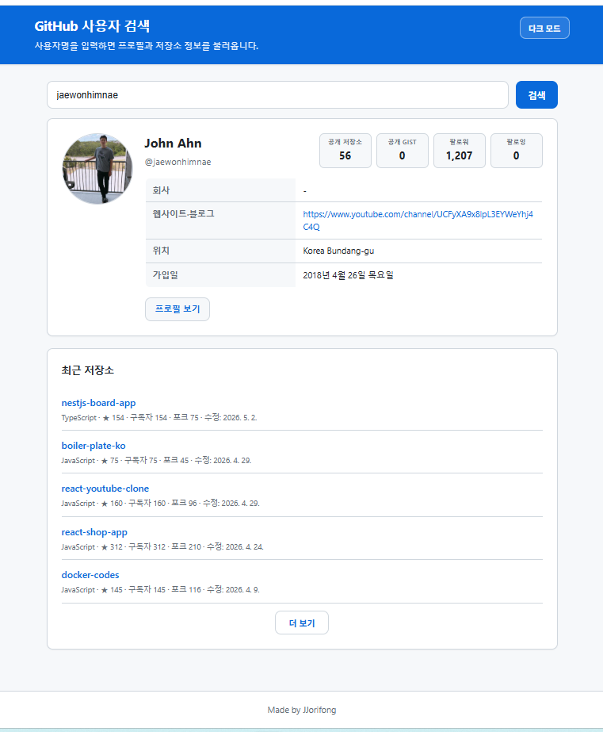

# GitHub Finder

JavaScript와 GitHub REST API를 사용해 GitHub 사용자 프로필과 저장소 정보를 조회·표시하는 웹 앱입니다.

## 미리보기

---

## 1. 과제 개요

- **과제명:** JavaScript를 이용한 GitHub Finder 앱 만들기
- **핵심 목표:** 단순 화면 모방이 아닌 실제 GitHub API 데이터 연동 및 시각화

---

## 2. 주요 기능

- GitHub 사용자명 입력 및 검색
- GitHub REST API 연동을 통한 사용자 데이터 수신
- 사용자 프로필 및 최신 저장소 목록 화면 출력
- 로딩 스피너, 빈 입력값, 404 예외처리
- 다크/라이트 모드 전환
- 저장소 더보기 (5개씩 페이지네이션 + 애니메이션)
- 시각장애인 접근성 (스크린리더 음성 안내, sr-only)
- 잔디밭(기여 그래프) 표시 기능

---

## 3. 사용 기술 스택

- HTML / CSS / JavaScript (ES6+)
- GitHub REST API
- OOP (Class 구조)
- async/await 비동기 처리
- 3파일 구조 (`index.html` / `style.css` / `app.js`)

---

## 4. 구현 흐름도

앱의 동작을 **입력 → 요청 → 응답 → 출력** 네 단계로 정리하면 다음과 같습니다.

1. **입력**  
   사용자가 검색 폼에 GitHub 사용자명을 입력하고 검색을 실행합니다. 빈 값이면 안내 메시지를 표시하고 API 호출은 하지 않습니다.

2. **요청**  
   입력된 사용자명으로 GitHub REST API에 `fetch` 요청을 보냅니다. 사용자 프로필(`GET /users/{username}`)과 공개 저장소 목록(`GET /users/{username}/repos`)을 순차적으로 요청합니다.

3. **응답**  
   서버에서 JSON 응답을 받습니다. 404·기타 HTTP 오류는 메시지로 처리하고, 성공 시 프로필 객체와 저장소 배열을 파싱합니다. 기여 그래프는 별도 이미지 URL(grass-graph)로 로드합니다.

4. **출력**  
   받은 데이터로 프로필 카드(아바타, 통계, 테이블, 기여 이미지)와 저장소 목록을 DOM에 반영합니다. 스크린리더용 `aria-live` 영역에 검색 성공 안내를 갱신하고, 테마·더보기 버튼 등 UI 상태를 맞춥니다.

---

## 5. AI 활용 과정 (프롬프트 3개 이상)

개발 과정에서 AI(Cursor 등)에 아래와 같은 방향으로 요청하며 코드를 보완했습니다.

1. **초기 앱 생성 프롬프트**  
   GitHub 사용자 검색, API 연동, 프로필·저장소 기본 UI를 갖춘 단일 HTML 앱의 뼈대를 만드는 요청

2. **OOP + async/await 리팩토링 프롬프트**  
   인라인 스크립트를 클래스 기반으로 정리하고, `fetch` 흐름을 `async/await`로 읽기 쉽게 바꾸는 요청

3. **시각장애인 접근성 추가 프롬프트**  
   검색 성공 시 `aria-live` 음성 안내, 에러 시 assertive 알림, 프로필 이미지 `alt` 개선, `sr-only` 처리 등 접근성 요구 반영 요청

4. **3파일 구조 분리 프롬프트**  
   마크업은 `index.html`, 스타일은 `style.css`, 로직은 `app.js`로 나누고 `link`/`script`로 연결하는 요청

---

## 6. 트러블슈팅

| 항목 | 내용 |
|------|------|
| **발생 문제** | 잔디밭 이미지 미표시 |
| **원인** | 외부 이미지 서비스(`grass-graph.moshimo.works`) 일시 장애 |
| **해결** | 이미지 로딩 실패 시 Contributions(기여 활동) 영역을 자동으로 숨기고, 서비스가 복구되어 이미지가 정상 로드되면 해당 영역이 다시 표시되도록 처리함 |

---

## 7. 학습 회고

- **새로 배운 것:** GitHub REST API 연동, OOP 클래스 구조, async/await, 시각장애인 접근성(라이브 리전, 대체 텍스트 등)
- **보완할 점:** 직접 코드를 이해하고 작성하는 능력 향상 필요
